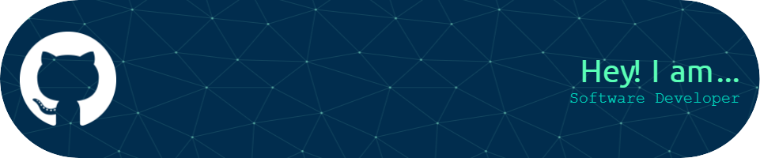

# 💫 About Me:

My name is Ritesh, 24, I have worked as an Associate Cloud Engineer for a year. In my short time there, I have worked on many projects and assisted with managing one project for one of the firm's long-time clients. But due to my spinal injury, I lost my job. Now I'm looking for a job. I would appreciate it if given a chance to prove my value addition for this job role.  

 

# 🌐 Socials:
 
 
 
 
 

 

# 💻 Languages and Tools:

  

 

# 💼 Work Experience:

<h2>Associate Cloud Engineer</h2>
    
<strong>Tudip Technologies, Pune, India</strong>

    
<em>Jun 2020 - Sep 2021</em>

    <ul>
        <li>Administered and tested different cloud platforms</li>
        <li>Identified bugs and created reports to highlight the status of all modules</li>
        <li>Dealt with the maintenance of environments</li>
    </ul>
     
    <h2>Projects:</h2>
    <ol>
        <li>
            <h3>Google Cloud Certification Administrator</h3>
            <ul>
                <li>Managed and updated certification data as database admin</li>
                <li>Worked on BigQuery, Google App Script, PLX Script, and troubleshooting Plx Query issues</li>
                <li>Created dashboards using Google Data Studio</li>
            </ul>
        </li>
        <li>
            <h3>Qwiklabs</h3>
            <ul>
                <li>Worked as Lab tester/publisher on Google Cloud Learning Platform - Qwiklabs</li>
                <li>Monitored and maintained GCP service</li>
                <li>Troubleshot outages to avoid minimal impact on active users</li>
                <li>Debugged and fixed issues</li>
            </ul>
        </li>
        <li>
            <h3>Google LX</h3>
            <ul>
                <li>Worked as System Admin on Google learning platform – Intellum</li>
                <li>Published and tested courses</li>
                <li>Enrolled Googlers and Nooglers to the courses</li>
                <li>Wrote SOPs</li>
                <li>Handled quarterly learning plans for Googlers</li>
            </ul>
        </li>
    </ol>

---

 

<!--  
  -->

   

## 🏆 GitHub Stats

<!--   --> 

 

 <!--- table style="flex border-collapse: collapse">
        <tr>
            <td style="padding: 8px;">
                
            </td>
            <td style="padding: 8px;">
                
            </td>
        </tr>
    </table ---- >

<!-- ### ✍️ Random Dev Quote
 -->

---
 

    

<!--
**KadvaSaach/KadvaSaach** is a ✨ _special_ ✨ repository because its `README.md` (this file) appears on your GitHub profile.

Here are some ideas to get you started:

- 🔭 I’m currently working on ...
- 🌱 I’m currently learning ...
- 👯 I’m looking to collaborate on ...
- 🤔 I’m looking for help with ...
- 💬 Ask me about ...
- 📫 How to reach me: ...
- 😄 Pronouns: ...
- ⚡ Fun fact: ...
-->
